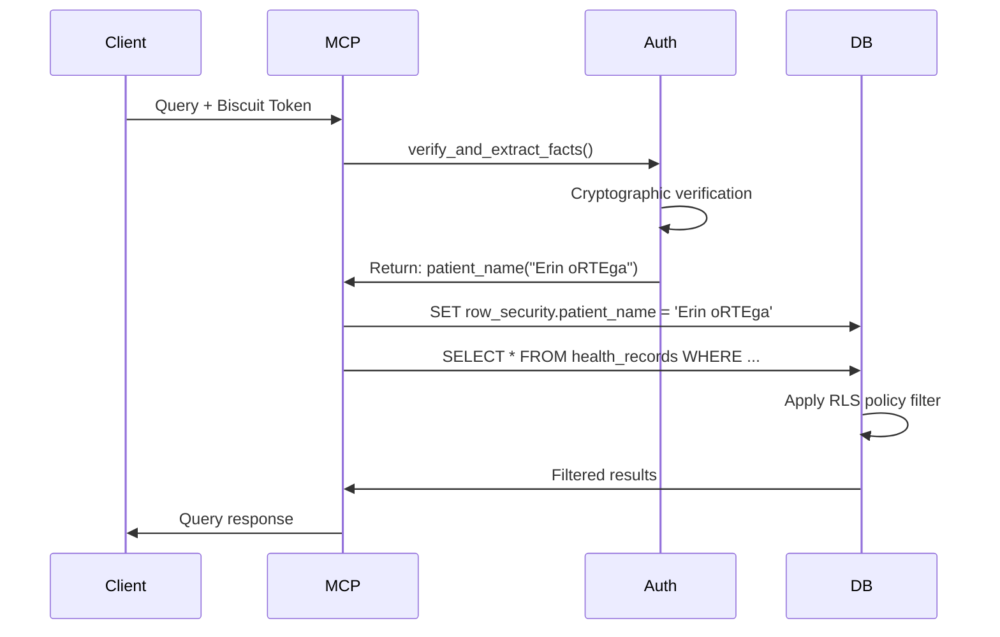

# MCP Biscuit Security Enforcement - Technical Deep Dive

This document explains how the security enforcement mechanism works in the MCP Biscuit Proof of Concept, detailing the cryptographic authorization flow and security model.

## Overview

The MCP Biscuit PoC demonstrates a security model where **Biscuit tokens** provide cryptographic proof of authorization for database access. Unlike traditional bearer tokens, Biscuit tokens contain embedded logic (facts, rules, and checks) that can be verified without server-side state.

## Architecture Components

### 1. Biscuit Token Structure

A Biscuit token in our system contains:

```
Token = {
    Facts: [patient_name("Erin oRTEga")],
    Rules: [],
    Checks: [],
    Signature: cryptographic_signature
}
```

**Key Properties:**
- **Cryptographically signed** with a private key
- **Verifiable** with the corresponding public key
- **Contains authorization logic** as first-class data
- **Tamper-proof** - any modification invalidates the signature

### 2. Token Generation Process

```mermaid
graph TD
    A[User Request] --> B[Generate Token]
    B --> C[Add Facts: patient_name("Erin")]
    C --> D[Add Rules: Optional]
    D --> E[Add Checks: Optional]
    E --> F[Sign with Private Key]
    F --> G[Base64 Encode]
    G --> H[Return Token + Public Key]
```

**Code Location:** `utilities/biscuit_generator.py:create_custom_token()`

```python
def create_custom_token(self, facts: List[str], rules: Optional[List[str]] = None, 
                      checks: Optional[List[str]] = None) -> str:
    builder = biscuit.BiscuitBuilder()
    
    # Add facts (e.g., patient_name("Erin oRTEga"))
    for fact_str in facts:
        builder.add_fact(biscuit.Fact(fact_str))
    
    # Sign and encode
    token = builder.build(self.private_key)
    return token.to_base64()
```

### 3. Security Enforcement Flow

#### Phase 1: Request Initiation
```
Client Request → MCP Server → Database Query Tool
```

#### Phase 2: Token Authentication
**Location:** `server/tools/query.py:authenticate_token()`

```python
def authenticate_token(biscuit_token: str):
    public_key = os.getenv('BISCUIT_PUBLIC_KEY')
    biscuit_parser = BiscuitParser(public_key)
    
    # Cryptographic verification + fact extraction
    facts = biscuit_parser.verify_and_extract_facts(biscuit_token)
    return facts
```

**What happens:**
1. **Cryptographic Verification**: Token signature validated against public key
2. **Fact Extraction**: Authorization facts extracted from token
3. **Database Context**: Facts applied to database session

#### Phase 3: Query Execution
**Location:** `server/tools/query.py:execute_query()`

```python
async def execute_query(query: str, conn_id: str, params=None, facts=None, ctx=Context):
    db = mcp.state["db"]
    
    async with db.get_connection(conn_id) as conn:
        # Enforce read-only mode
        await conn.execute("SET TRANSACTION READ ONLY")
        
        # Execute with token context
        records = await conn.fetch(query, *(params or []))
        return [dict(record) for record in records]
```

### 4. Authorization Logic

#### Token-Based Facts
The system extracts facts from the Biscuit token:

```datalog
// From token: patient_name("Erin oRTEga")
patient_name("Erin oRTEga")
```

#### Database Authorization
The token facts are used to establish database session context. When a query is executed:

1. **Token Verification**: Cryptographic signature validated
2. **Fact Application**: Token facts applied to session
3. **Query Execution**: SQL executed with token context
4. **Result Filtering**: Results potentially filtered based on token constraints

### 5. Security Properties

#### Cryptographic Integrity
- **Unforgeable**: Tokens cannot be created without the private key
- **Tamper-evident**: Any modification breaks the cryptographic signature
- **Verifiable**: Anyone with the public key can verify token authenticity

#### Authorization Logic
- **Embedded Authorization**: Logic lives in the token, not the server
- **Stateless Verification**: No server-side session state required
- **Fine-grained Control**: Specific facts like patient names can be embedded

#### Attack Resistance
- **Replay Protection**: Tokens can include time bounds (not implemented in this PoC)
- **Scope Limitation**: Tokens contain only specific authorization facts
- **Privilege Escalation Prevention**: Users cannot modify token contents

### 6. PostgreSQL Security Enforcement

The system implements a multi-layered security approach that extends beyond biscuit tokens into PostgreSQL's native security features.

#### Database User Privilege Model

**Administrative User (`postgres`)**:
- Full database privileges
- Can set session configuration parameters
- Bypasses Row-Level Security (RLS) policies
- Used for initial setup and privileged operations

**Restricted User (`patients`)**:
- Limited SELECT privileges on `health_records` table
- Cannot set arbitrary session configuration parameters
- Subject to Row-Level Security policies
- Demonstrates security boundary enforcement

#### Row-Level Security (RLS) Implementation

PostgreSQL's RLS provides fine-grained access control at the row level:

```sql
-- Enable RLS on the health_records table
ALTER TABLE health_records ENABLE ROW LEVEL SECURITY;

-- Create policy for patients user
CREATE POLICY patient_data_access ON health_records
    FOR SELECT 
    TO patients
    USING (
        "Patient Name" = current_setting('row_security.patient_name', true)
    );
```

**How it works:**
1. **Session Context**: Biscuit token facts are applied as session parameters
2. **Policy Evaluation**: RLS policy checks `current_setting('row_security.patient_name')`
3. **Row Filtering**: Only rows matching the session context are returned

#### Token-to-Database Context Flow



#### Security Parameter Setting

**Code Location:** `server/tools/query.py:execute_query()`

```python
async def execute_query(query: str, conn_id: str, params=None, facts=None, ctx=Context):
    db = mcp.state["db"]
    
    async with db.get_connection(conn_id) as conn:
        # Apply biscuit token facts as session parameters
        if facts and 'facts' in facts:
            for fact_type, values in facts['facts'].items():
                if fact_type == 'patients' and values:
                    # Extract patient name from biscuit token
                    patient_name = values[0][0]  # First patient from facts
                    await conn.execute(
                        f"SET row_security.patient_name = '{patient_name}'"
                    )
        
        # Enforce read-only mode
        await conn.execute("SET TRANSACTION READ ONLY")
        
        # Execute query with RLS enforcement
        records = await conn.fetch(query, *(params or []))
        return [dict(record) for record in records]
```

### 6.1 Error Scenarios and Security Boundaries

#### Successful Authorization (Admin User)
```
Token: patient_name("Erin oRTEga") 
User: postgres (admin)
Query: SELECT * FROM health_records WHERE "Patient Name" = 'Erin oRTEga'
Result: ✅ All matching records returned (RLS bypassed)
```

#### Successful Authorization (Restricted User)
```
Token: patient_name("Erin oRTEga")
User: patients (restricted)
Database: SET row_security.patient_name = 'Erin oRTEga'
Query: SELECT * FROM health_records
Result: ✅ Only Erin's records returned (RLS enforced)
```

#### Invalid Token
```
Tampered Token → Signature verification fails → ❌ Authentication error
No database interaction occurs
```

#### Insufficient Database Privileges
```
Valid Token + Restricted DB User → Configuration parameter error → ❌ Authorization fails
Error: "unrecognized configuration parameter 'patient_name'"
```

**This demonstrates defense in depth:**
- **Layer 1**: Cryptographic token verification
- **Layer 2**: Database user privilege validation  
- **Layer 3**: Row-level security policy enforcement

### 6.2 Database Security Policies

#### RLS Policy Logic
The Row-Level Security policy acts as a final filter:

```sql
-- Policy definition
USING ("Patient Name" = current_setting('row_security.patient_name', true))
```

**Behavior:**
- If `row_security.patient_name` is set: Only matching rows returned
- If parameter not set: Policy fails, no rows returned
- If user bypasses RLS (like `postgres`): All rows returned regardless

### 7. Implementation Details

#### Key Components

**Token Parser** (`biscuit_parser_module.py`):
```python
class BiscuitParser:
    def verify_and_extract_facts(self, token_b64: str) -> Dict[str, Any]:
        verified_token = biscuit.Biscuit.from_base64(token_b64, self.public_key)
        # Extract facts using Datalog queries
        authorizer = biscuit.Authorizer(f"time({current_timestamp});")
        authorizer.add_token(verified_token)
        facts = authorizer.query('$pred($args)')
        return facts
```

**MCP Tool Integration** (`server/tools/query.py`):
```python
@mcp.tool()
async def pg_query(biscuit_token: str, query: str, conn_id: str, params=None):
    # 1. Authenticate and extract facts from token
    facts = authenticate_token(biscuit_token)
    
    # 2. Execute query with token context
    return await execute_query(query, conn_id, params, facts)
```

#### Security Boundaries

1. **Token Boundary**: Cryptographic verification prevents token tampering
2. **Database Boundary**: Database privileges control what the token can actually do
3. **Application Boundary**: MCP server enforces read-only transactions
4. **Network Boundary**: HTTPS recommended for token transport (not shown in PoC)

### 8. Comparison with Traditional Security

| Aspect | Traditional Tokens | Biscuit Tokens |
|--------|-------------------|----------------|
| **Storage** | Server-side sessions | Self-contained |
| **Logic** | Server authorization code | Embedded in token |
| **Verification** | Database/cache lookup | Cryptographic signature |
| **Attenuation** | New tokens from server | Client-side token restriction |
| **Auditability** | Server logs only | Token contents + server logs |

### 9. Security Considerations

#### Current PoC Limitations
- **No time bounds**: Tokens don't expire (could add `expiry()` facts)
- **No revocation**: No mechanism to invalidate tokens
- **Transport security**: No HTTPS enforcement shown
- **Key management**: Private keys need secure storage

#### Production Readiness Requirements
- **Key rotation**: Regular private key rotation
- **Token revocation**: Maintain revocation lists
- **Time bounds**: Add expiration to all tokens
- **Audit logging**: Comprehensive request logging
- **Rate limiting**: Prevent token abuse

### 10. Extending the Security Model

#### Adding Time Constraints
```python
# Generate time-limited token
expiry = datetime.now() + timedelta(hours=1)
facts = [
    'patient_name("Erin oRTEga")', 
    f'expiry({int(expiry.timestamp())})'
]
checks = ['check if time($time), expiry($exp), $time <= $exp']
```

#### Adding Role-Based Access
```python
facts = [
    'user("alice")',
    'role("nurse")',
    'department("cardiology")'
]
rules = [
    'allow($u, $r, "read") <- user($u), role("nurse"), resource($r)'
]
```

#### Resource-Scoped Access
```python
facts = ['resource("patient_records")', 'operation("read")']
checks = ['check if resource("patient_records")', 'check if operation("read")']
```

## Conclusion

The MCP Biscuit PoC demonstrates a powerful security model where authorization logic is embedded in cryptographically secure tokens. This approach provides:

- **Stateless authorization** without server-side sessions
- **Fine-grained permissions** through embedded facts and rules
- **Cryptographic integrity** preventing token tampering
- **Flexible authorization logic** through Datalog-based rules

The system successfully shows how modern authorization tokens can move beyond simple bearer tokens to provide rich, verifiable authorization contexts for API access.