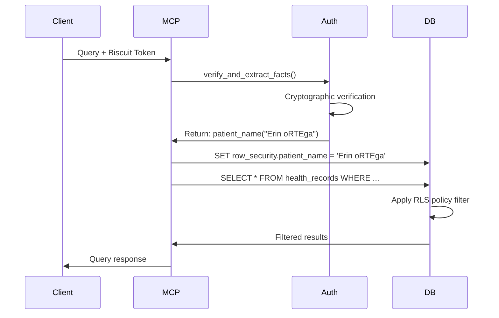
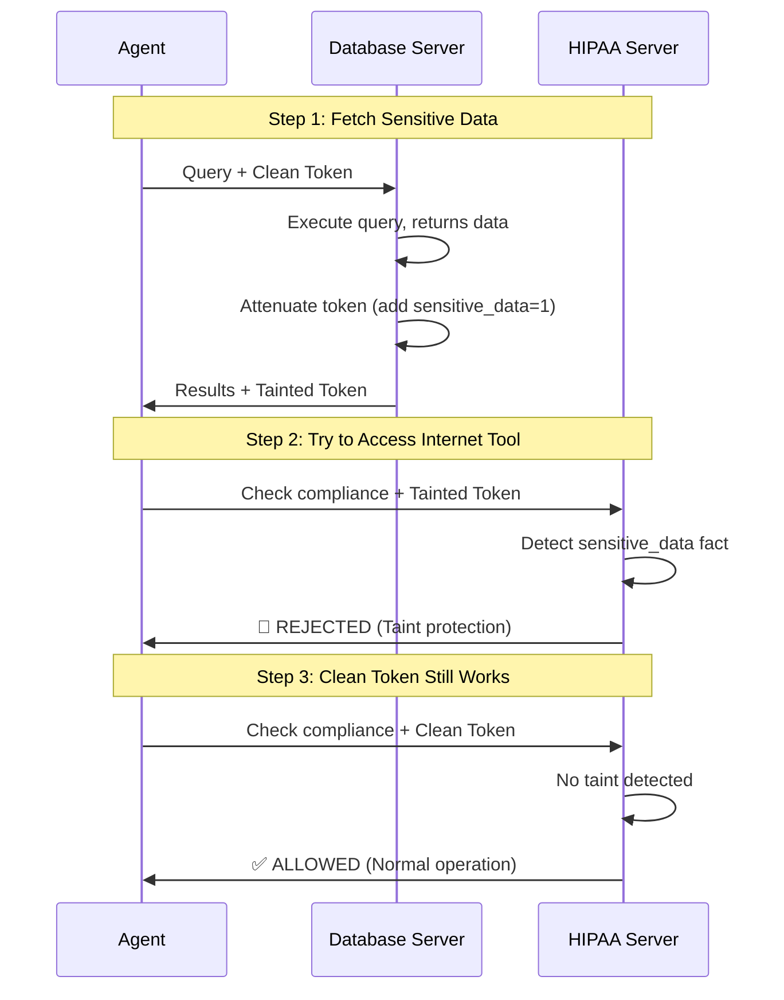

# MCP Biscuit Security Enforcement - Technical Deep Dive

This document explains how the security enforcement mechanism works in the MCP Biscuit Proof of Concept, detailing the cryptographic authorization flow and security model.

## Overview

The MCP Biscuit PoC demonstrates a security model where **Biscuit tokens** provide cryptographic proof of authorization for database access. Unlike traditional bearer tokens, Biscuit tokens contain embedded logic (facts, rules, and checks) that can be verified without server-side state.

## Architecture Components

### 1. Biscuit Token Structure

A Biscuit token in our system contains:

```
Token = {
    Facts: [patient_name("Erin oRTEga")],
    Rules: [],
    Checks: [],
    Signature: cryptographic_signature
}
```

**Key Properties:**
- **Cryptographically signed** with a private key
- **Verifiable** with the corresponding public key
- **Contains authorization logic** as first-class data
- **Tamper-proof** - any modification invalidates the signature

### 2. Token Generation Process

```mermaid
graph TD
    A[User Request] --> B[Generate Token]
    B --> C[Add Facts: patient_name("Erin")]
    C --> D[Add Rules: Optional]
    D --> E[Add Checks: Optional]
    E --> F[Sign with Private Key]
    F --> G[Base64 Encode]
    G --> H[Return Token + Public Key]
```

**Code Location:** `utilities/biscuit_generator.py:create_custom_token()`

```python
def create_custom_token(self, facts: List[str], rules: Optional[List[str]] = None, 
                      checks: Optional[List[str]] = None) -> str:
    builder = biscuit.BiscuitBuilder()
    
    # Add facts (e.g., patient_name("Erin oRTEga"))
    for fact_str in facts:
        builder.add_fact(biscuit.Fact(fact_str))
    
    # Sign and encode
    token = builder.build(self.private_key)
    return token.to_base64()
```

### 3. Security Enforcement Flow

#### Phase 1: Request Initiation
```
Client Request → MCP Server → Database Query Tool
```

#### Phase 2: Token Authentication
**Location:** `server/tools/query.py:authenticate_token()`

```python
def authenticate_token(biscuit_token: str):
    public_key = os.getenv('BISCUIT_PUBLIC_KEY')
    biscuit_parser = BiscuitParser(public_key)
    
    # Cryptographic verification + fact extraction
    facts = biscuit_parser.verify_and_extract_facts(biscuit_token)
    return facts
```

**What happens:**
1. **Cryptographic Verification**: Token signature validated against public key
2. **Fact Extraction**: Authorization facts extracted from token
3. **Database Context**: Facts applied to database session

#### Phase 3: Query Execution
**Location:** `server/tools/query.py:execute_query()`

```python
async def execute_query(query: str, conn_id: str, params=None, facts=None, ctx=Context):
    db = mcp.state["db"]
    
    async with db.get_connection(conn_id) as conn:
        # Enforce read-only mode
        await conn.execute("SET TRANSACTION READ ONLY")
        
        # Execute with token context
        records = await conn.fetch(query, *(params or []))
        return [dict(record) for record in records]
```

### 4. Authorization Logic

#### Token-Based Facts
The system extracts facts from the Biscuit token:

```datalog
// From token: patient_name("Erin oRTEga")
patient_name("Erin oRTEga")
```

#### Database Authorization
The token facts are used to establish database session context. When a query is executed:

1. **Token Verification**: Cryptographic signature validated
2. **Fact Application**: Token facts applied to session
3. **Query Execution**: SQL executed with token context
4. **Result Filtering**: Results potentially filtered based on token constraints

### 5. Security Properties

#### Cryptographic Integrity
- **Unforgeable**: Tokens cannot be created without the private key
- **Tamper-evident**: Any modification breaks the cryptographic signature
- **Verifiable**: Anyone with the public key can verify token authenticity

#### Authorization Logic
- **Embedded Authorization**: Logic lives in the token, not the server
- **Stateless Verification**: No server-side session state required
- **Fine-grained Control**: Specific facts like patient names can be embedded

#### Attack Resistance
- **Replay Protection**: Tokens can include time bounds (not implemented in this PoC)
- **Scope Limitation**: Tokens contain only specific authorization facts
- **Privilege Escalation Prevention**: Users cannot modify token contents

### 6. PostgreSQL Security Enforcement

The system implements a multi-layered security approach that extends beyond biscuit tokens into PostgreSQL's native security features.

#### Database User Privilege Model

**Administrative User (`postgres`)**:
- Full database privileges
- Can set session configuration parameters
- Bypasses Row-Level Security (RLS) policies
- Used for initial setup and privileged operations

**Restricted User (`patients`)**:
- Limited SELECT privileges on `health_records` table
- Cannot set arbitrary session configuration parameters
- Subject to Row-Level Security policies
- Demonstrates security boundary enforcement

#### Row-Level Security (RLS) Implementation

PostgreSQL's RLS provides fine-grained access control at the row level:

```sql
-- Enable RLS on the health_records table
ALTER TABLE health_records ENABLE ROW LEVEL SECURITY;

-- Create policy for patients user
CREATE POLICY patient_data_access ON health_records
    FOR SELECT 
    TO patients
    USING (
        "Patient Name" = current_setting('row_security.patient_name', true)
    );
```

**How it works:**
1. **Session Context**: Biscuit token facts are applied as session parameters
2. **Policy Evaluation**: RLS policy checks `current_setting('row_security.patient_name')`
3. **Row Filtering**: Only rows matching the session context are returned

#### Token-to-Database Context Flow


```mermaid
sequenceDiagram
    participant Client
    participant MCP
    participant Auth
    participant DB
    
    Client->>MCP: Query + Biscuit Token
    MCP->>Auth: verify_and_extract_facts()
    Auth->>Auth: Cryptographic verification
    Auth->>MCP: Return: patient_name("Erin oRTEga")
    MCP->>DB: SET row_security.patient_name = 'Erin oRTEga'
    MCP->>DB: SELECT * FROM health_records WHERE ...
    DB->>DB: Apply RLS policy filter
    DB->>MCP: Filtered results
    MCP->>Client: Query response
```

#### Security Parameter Setting

**Code Location:** `server/tools/query.py:execute_query()`

```python
async def execute_query(query: str, conn_id: str, params=None, facts=None, ctx=Context):
    db = mcp.state["db"]
    
    async with db.get_connection(conn_id) as conn:
        # Apply biscuit token facts as session parameters
        if facts and 'facts' in facts:
            for fact_type, values in facts['facts'].items():
                if fact_type == 'patients' and values:
                    # Extract patient name from biscuit token
                    patient_name = values[0][0]  # First patient from facts
                    await conn.execute(
                        f"SET row_security.patient_name = '{patient_name}'"
                    )
        
        # Enforce read-only mode
        await conn.execute("SET TRANSACTION READ ONLY")
        
        # Execute query with RLS enforcement
        records = await conn.fetch(query, *(params or []))
        return [dict(record) for record in records]
```

### 6.1 Error Scenarios and Security Boundaries

#### Successful Authorization (Admin User)
```
Token: patient_name("Erin oRTEga") 
User: postgres (admin)
Query: SELECT * FROM health_records WHERE "Patient Name" = 'Erin oRTEga'
Result: ✅ All matching records returned (RLS bypassed)
```

#### Successful Authorization (Restricted User)
```
Token: patient_name("Erin oRTEga")
User: patients (restricted)
Database: SET row_security.patient_name = 'Erin oRTEga'
Query: SELECT * FROM health_records
Result: ✅ Only Erin's records returned (RLS enforced)
```

#### Invalid Token
```
Tampered Token → Signature verification fails → ❌ Authentication error
No database interaction occurs
```

#### Insufficient Database Privileges
```
Valid Token + Restricted DB User → Configuration parameter error → ❌ Authorization fails
Error: "unrecognized configuration parameter 'patient_name'"
```

**This demonstrates defense in depth:**
- **Layer 1**: Cryptographic token verification
- **Layer 2**: Database user privilege validation  
- **Layer 3**: Row-level security policy enforcement

### 6.2 Database Security Policies

#### RLS Policy Logic
The Row-Level Security policy acts as a final filter:

```sql
-- Policy definition
USING ("Patient Name" = current_setting('row_security.patient_name', true))
```

**Behavior:**
- If `row_security.patient_name` is set: Only matching rows returned
- If parameter not set: Policy fails, no rows returned
- If user bypasses RLS (like `postgres`): All rows returned regardless

### 7. Implementation Details

#### Key Components

**Token Parser** (`biscuit_parser_module.py`):
```python
class BiscuitParser:
    def verify_and_extract_facts(self, token_b64: str) -> Dict[str, Any]:
        verified_token = biscuit.Biscuit.from_base64(token_b64, self.public_key)
        # Extract facts using Datalog queries
        authorizer = biscuit.Authorizer(f"time({current_timestamp});")
        authorizer.add_token(verified_token)
        facts = authorizer.query('$pred($args)')
        return facts
```

**MCP Tool Integration** (`server/tools/query.py`):
```python
@mcp.tool()
async def pg_query(biscuit_token: str, query: str, conn_id: str, params=None):
    # 1. Authenticate and extract facts from token
    facts = authenticate_token(biscuit_token)
    
    # 2. Execute query with token context
    return await execute_query(query, conn_id, params, facts)
```

#### Security Boundaries

1. **Token Boundary**: Cryptographic verification prevents token tampering
2. **Database Boundary**: Database privileges control what the token can actually do
3. **Application Boundary**: MCP server enforces read-only transactions
4. **Network Boundary**: HTTPS recommended for token transport (not shown in PoC)

### 8. Comparison with Traditional Security

| Aspect | Traditional Tokens | Biscuit Tokens |
|--------|-------------------|----------------|
| **Storage** | Server-side sessions | Self-contained |
| **Logic** | Server authorization code | Embedded in token |
| **Verification** | Database/cache lookup | Cryptographic signature |
| **Attenuation** | New tokens from server | Client-side token restriction |
| **Auditability** | Server logs only | Token contents + server logs |

### 9. Security Considerations

#### Current PoC Limitations
- **No time bounds**: Tokens don't expire (could add `expiry()` facts)
- **No revocation**: No mechanism to invalidate tokens
- **Transport security**: No HTTPS enforcement shown
- **Key management**: Private keys need secure storage

#### Production Readiness Requirements
- **Key rotation**: Regular private key rotation
- **Token revocation**: Maintain revocation lists
- **Time bounds**: Add expiration to all tokens
- **Audit logging**: Comprehensive request logging
- **Rate limiting**: Prevent token abuse

### 10. Extending the Security Model

#### Adding Time Constraints
```python
# Generate time-limited token
expiry = datetime.now() + timedelta(hours=1)
facts = [
    'patient_name("Erin oRTEga")', 
    f'expiry({int(expiry.timestamp())})'
]
checks = ['check if time($time), expiry($exp), $time <= $exp']
```

#### Adding Role-Based Access
```python
facts = [
    'user("alice")',
    'role("nurse")',
    'department("cardiology")'
]
rules = [
    'allow($u, $r, "read") <- user($u), role("nurse"), resource($r)'
]
```

#### Resource-Scoped Access
```python
facts = ['resource("patient_records")', 'operation("read")']
checks = ['check if resource("patient_records")', 'check if operation("read")']
```

## 11. Data Taint Protection (Anti-Exfiltration Mechanism)

### Overview

The system implements **information flow control** through token attenuation to prevent data exfiltration. Once a token has been used to access sensitive data, it is "tainted" and cannot be used to access internet-accessible services.

### Problem Statement

In a multi-tool AI agent environment:
- Agent can query healthcare database for sensitive patient data
- Agent can also access internet-connected tools (HIPAA compliance checker, external APIs, etc.)
- **Risk**: Sensitive data could be accidentally or maliciously sent to external services

**Traditional solutions** (like access control lists) don't prevent data flow after access has been granted.

### Biscuit Token Attenuation Solution

Biscuit tokens support **attenuation** - adding new blocks with additional restrictions. The system uses this to "taint" tokens after they access sensitive data.

#### Attenuation Mechanism

**Code Location:** `biscuit_parser_module.py:attenuate_with_sensitive_data()`

```python
def attenuate_with_sensitive_data(self, token_b64: str) -> Dict[str, Any]:
    """Attenuate token by appending a sensitive_data=1 fact in a new block."""
    verified_token = biscuit.Biscuit.from_base64(token_b64, self.public_key)

    # Create new block with taint marker
    block_builder = biscuit.BlockBuilder()
    block_builder.add_code("sensitive_data(1);")

    # Append block to token
    attenuated_token = verified_token.append(block_builder)
    return {"attenuated_token": attenuated_token.to_base64()}
```

**Token Structure Before and After**:
```
Clean Token (1 block):
  Block 0: patient_name("Erin oRTEga")

Attenuated Token (2 blocks):
  Block 0: patient_name("Erin oRTEga")
  Block 1: sensitive_data(1)            ← Taint marker
```

### Implementation Flow

#### Phase 1: Database Access (server/tools/query.py)

```python
@mcp.tool()
async def pg_query(biscuit_token: str, query: str, conn_id: str, params=None):
    # Execute database query
    query_results = await execute_query(query, conn_id, params, facts)

    # If data was fetched, attenuate the token
    if query_results and len(query_results) > 0:
        parser = BiscuitParser(public_key_hex)
        attenuation_result = parser.attenuate_with_sensitive_data(biscuit_token)

        return {
            "data": query_results,
            "token": attenuation_result["attenuated_token"]  # Return tainted token
        }
```

**Key Points**:
- Database server automatically taints tokens after returning data
- Client receives both query results AND attenuated token
- Original token remains valid for other uses

#### Phase 2: Taint Detection (hipaa-server/tools/regulations.py)

```python
def authenticate_token(biscuit_token: str) -> Dict[str, Any]:
    parser = BiscuitParser(public_key)

    # Check for sensitive_data taint
    taint_check = parser.check_sensitive_data(biscuit_token)

    if taint_check.get("is_tainted"):
        return {
            "authenticated": False,
            "error": "Token has been tainted with sensitive data. Cannot access internet-accessible tools."
        }

    # Continue with normal verification...
```

#### Phase 3: Fact Detection via Block Inspection

Due to limitations in biscuit-python 0.4.0 (queries don't work across multiple blocks), we inspect block source code directly:

**Code Location:** `biscuit_parser_module.py:check_fact_with_authorization()`

```python
def check_fact_with_authorization(self, token_b64: str, fact_check: str):
    verified_token = biscuit.Biscuit.from_base64(token_b64, self.public_key)

    # Inspect all blocks for the fact
    for i in range(verified_token.block_count()):
        block_source = verified_token.block_source(i)

        # Check if fact appears in block source
        if f"{fact_check}(" in block_source:
            return {"fact_found": True, "found_in_block": i}

    return {"fact_found": False}
```

### Security Flow Diagram


```mermaid
sequenceDiagram
    participant Agent
    participant DB as Database Server
    participant HIPAA as HIPAA Server

    Note over Agent,HIPAA: Step 1: Fetch Sensitive Data
    Agent->>DB: Query + Clean Token
    DB->>DB: Execute query, returns data
    DB->>DB: Attenuate token (add sensitive_data=1)
    DB->>Agent: Results + Tainted Token

    Note over Agent,HIPAA: Step 2: Try to Access Internet Tool
    Agent->>HIPAA: Check compliance + Tainted Token
    HIPAA->>HIPAA: Detect sensitive_data fact
    HIPAA->>Agent: 🚫 REJECTED (Taint protection)

    Note over Agent,HIPAA: Step 3: Clean Token Still Works
    Agent->>HIPAA: Check compliance + Clean Token
    HIPAA->>HIPAA: No taint detected
    HIPAA->>Agent: ✅ ALLOWED (Normal operation)
```

### Security Properties

#### Information Flow Control
- **Taint Tracking**: Tokens carry evidence of having accessed sensitive data
- **Non-Bypassable**: Cryptographically enforced through token signature
- **Granular**: Only tokens that actually fetched data are tainted

#### Attack Resistance
- **Cannot Remove Taint**: Removing block 1 would break the token signature
- **Cannot Forge Clean Token**: Would require private key to create valid signature
- **Automatic Enforcement**: No manual checks needed - enforced at token level

#### Operational Benefits
- **No Central Tracking**: No server-side state required to track tainted tokens
- **Parallel Sessions**: Same user can have both clean and tainted tokens simultaneously
- **Explicit Control**: Clear separation between data access and internet access tools

### Testing Results

**End-to-End Test:** `local/test_data_taint_e2e.py`

```
✅ Clean token → Database query → Success (returns data + tainted token)
✅ Tainted token → HIPAA server → REJECTED (🔒 Data exfiltration prevented)
✅ Clean token → HIPAA server → ALLOWED (normal operation)
```

### Limitations and Future Work

#### Current Limitations
- **Binary Taint**: Either tainted or not - no levels of sensitivity
- **No Expiration**: Taint lasts forever (could add time bounds)
- **All Data Treated Equal**: No differentiation between public and private data

#### Potential Enhancements
```python
# Granular taint levels
sensitive_data("level:PHI")    # Protected Health Information
sensitive_data("level:PII")    # Personally Identifiable Information

# Time-limited taint
sensitive_data(1), taint_expires(timestamp + 3600)

# Conditional taint
sensitive_data_if(patient_count > 1)  # Only taint if bulk query
```

### Comparison with Alternative Approaches

| Approach | Implementation | Bypasable? | Scalability |
|----------|---------------|-----------|-------------|
| **Access Control Lists** | Server maintains list of allowed combinations | Yes (timing attacks) | Poor (state required) |
| **Runtime Monitoring** | Observe and block suspicious calls | Yes (covert channels) | Medium (overhead) |
| **Static Analysis** | Analyze code for data flows | N/A (pre-runtime) | Good (compile-time) |
| **Token Tainting** | Cryptographic evidence in token | No (signature-based) | Excellent (stateless) |

### Real-World Applications

#### Healthcare (HIPAA Compliance)
- Prevent PHI from being sent to logging services
- Block analytics tools after patient data access
- Ensure audit logs don't contain sensitive queries

#### Financial Services
- Prevent PCI data from reaching external APIs
- Block customer data from telemetry systems
- Ensure compliance with data residency requirements

#### Enterprise Security
- Prevent confidential data exfiltration
- Enforce data classification policies
- Implement Chinese Wall security policies

## Conclusion

The MCP Biscuit PoC demonstrates a powerful security model where authorization logic is embedded in cryptographically secure tokens. This approach provides:

- **Stateless authorization** without server-side sessions
- **Fine-grained permissions** through embedded facts and rules
- **Cryptographic integrity** preventing token tampering
- **Flexible authorization logic** through Datalog-based rules
- **Information flow control** preventing data exfiltration through token attenuation

The system successfully shows how modern authorization tokens can move beyond simple bearer tokens to provide rich, verifiable authorization contexts for API access while enforcing complex security policies like data taint tracking.